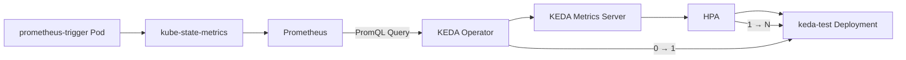

> 이전 테스트에서는 KEDA `ScaledObject`를 이용하여 Deployment의 Replica를 **0개까지 줄이는 Scale to Zero** 동작을 확인했습니다.
> 
> 이번에는 한 단계 더 나아가 **Prometheus에 수집된 메트릭을 기준으로 Deployment의 Replica가 자동으로 증가하고, 메트릭이 사라지면 다시 0개까지 감소하는 Prometheus Scaler 테스트**를 진행합니다.
{: .prompt-info}

## 1. 테스트 구성 :

- 이번 테스트의 전체 구조는 다음과 같습니다.



* * *

## 2. 사전 환경 확인하기 :

- KEDA 설치해야 하므로 환경 구성이 안되어있을 경우, 아래 링크를 통해서 설치 진행하면됩니다.
> * [Helm Chart를 통해 KEDA 설치하기](https://hwangyoonjae.github.io/posts/Helm-Helm-Chart%EB%A5%BC-%ED%86%B5%ED%95%B4-KEDA-%EC%84%A4%EC%B9%98%ED%95%98%EA%B8%B0/ "Helm Chart를 통해 KEDA 설치하기")

* * *

## 3. Scale 대상 Deployment 생성하기 :

- KEDA가 실제로 Scale Out / Scale In할 Deployment를 생성합니다.

```bash
$ vi keda-test.yaml
```
```yaml
apiVersion: apps/v1
kind: Deployment
metadata:
  name: keda-test
  namespace: keda-demo
spec:
  replicas: 0

  selector:
    matchLabels:
      app: keda-test

  template:
    metadata:
      labels:
        app: keda-test

    spec:
      containers:
        - name: nginx
          image: harbor.test.com/library/nginx:1.25.3
          ports:
            - containerPort: 80
```
```bash
# 생성
$ kubectl apply -f keda-test.yaml
```

* * * 

- 생성 후, 정상인지 확인합니다.

```bash
$ kubectl get deployment -n keda-demo
```

> 현재 `replicas`를 `0`으로 설정했기 때문에 다음과 같이 확인됩니다.
> 
> 이후 Prometheus 메트릭이 활성화되었을 때 KEDA가 해당 Deployment의 Replica를 증가시키는지 확인합니다.
{: .prompt-warning}

* * * 

## 4. Prometheus 확인하기 :
### 4.1 Prometheus Service 확인하기 :

- 클러스터에 설치된 Prometheus Service를 확인합니다.

```bash
$ kubectl get svc -A | grep -i prometheus
```


* * *

- 이 경우 클러스터 내부에서 사용할 Prometheus 주소는 다음과 같습니다.

```text
http://prometheus-k8s.monitoring.svc:9090
```

> Prometheus Service 이름과 Namespace는 설치 환경마다 다를 수 있으므로 반드시 실제 환경의 `kubectl get svc -A` 결과를 확인한 뒤 적용해야 합니다.
{: .prompt-warning}

* * *

### 4.2 Prometheus 연결 확인하기 :

- Prometheus UI를 직접 확인하려면 Port Forward를 사용할 수 있지만, 필자는 Ingress를 생성했습니다.
- 생성 후, 브라우저의 host 정보로 접속합니다.

```yaml
apiVersion: networking.k8s.io/v1
kind: Ingress
  name: ingress-monitoring
  namespace: monitoring
spec:
  ingressClassName: nginx
  rules:
  - host: prometheus.test.com
    http:
      paths:
      - backend:
          service:
            name: prometheus-k8s
            port:
              number: 9090
        path: /
        pathType: Prefix
```
```bash
# 생성
$ kubectl apply -f monitoring-ingress.yaml
```


* * *

## 5. kube-state-metrics 확인하기 :

- `kube-state-metrics`에서 제공하는 Kubernetes Pod 정보를 사용할거고, 먼저 Prometheus에서 다음 Query를 실행합니다.

```promql
kube_pod_info
```


* * * 

- 결과가 조회되는지 확인하며, Namespace를 한정해서 확인할 수도 있습니다.

```promql
kube_pod_info{namespace="keda-demo"}
```


> 현재 `prometheus-trigger` Pod가 존재하지 않으므로 이후 사용할 Query의 결과는 `0`이어야 합니다.
{: .prompt-tip}

* * *

## 6. Prometheus Scaler에서 사용할 메트릭 확인하기 :

> KEDA의 Prometheus Scaler는 Prometheus에 저장된 메트릭 값을 조회하고, 해당 값을 기준으로 Deployment의 Replica 수를 조절합니다.
> 
> 실제 서비스의 HTTP 요청량이나 CPU 사용량 대신, prometheus-trigger-로 시작하는 테스트 Pod의 개수를 스케일링 이벤트로 사용합니다.
{: .prompt-info}


### 6.1 PromQL 작성하기 :

- 아래와 같이 PromQL을 사용합니다.

```promql
sum(kube_pod_info{namespace="keda-demo",pod=~"prometheus-trigger-.*"}) or vector(0)
```


> 현재는 prometheus-trigger-* Pod를 아직 생성하지 않았기 때문에 쿼리 결과가 0으로 반환되는 것이 정상입니다.
{: .prompt-info}

* * *

## 7. Prometheus ScaledObject 생성하기 :
### 7.1 ScaledObject 생성하기 :

- 앞에서 작성한 PromQL을 사용하는 KEDA `ScaledObject`를 생성합니다.

```bash
$ vi prometheus-scaledobject.yaml
```
```yaml
apiVersion: keda.sh/v1alpha1
kind: ScaledObject
metadata:
  name: keda-test-prometheus
  namespace: keda-demo

spec:
  scaleTargetRef:
    name: keda-test

  pollingInterval: 5
  cooldownPeriod: 30

  minReplicaCount: 0
  maxReplicaCount: 5

  triggers:
    - type: prometheus
      metadata:
        serverAddress: http://prometheus-k8s.secloudit-monitoring.svc:9090
        query: |
          sum(kube_pod_info{namespace="keda-demo",pod=~"prometheus-trigger-.*"}) or vector(0)
        threshold: "1"
        activationThreshold: "0"
```
```bash
# 생성
$ kubectl apply -f prometheus-scaledobject.yaml
```

> `serverAddress`는 실제 환경의 Prometheus Service 주소에 맞게 변경해야 합니다.
> {: .prompt-warning}

* * * 

### 7.2 ScaledObject 상태 확인하기 :

- 생성된 ScaledObject를 확인합니다.

```bash
$ kubectl get scaledobject -n keda-demo
```


* * *

### 7.3 HPA 생성 확인하기 :

```bash
$ kubectl get hpa -n keda-demo
```


* * *

## 8. Prometheus Trigger 테스트 Pod 생성하기 :

- 이제 실제로 Prometheus 메트릭 값을 변경하기 위한 테스트 이벤트를 발생시켜야 하기 때문에 `prometheus-trigger-`로 시작하는 Pod를 하나 생성합니다.

```bash
$ vi prometheus-trigger.yaml
```
```yaml
apiVersion: v1
kind: Pod
metadata:
  name: prometheus-trigger-test
  namespace: keda-demo

spec:
  containers:
    - name: nginx
      image: harbor.test.com/library/nginx:1.25.3
```
```bash
# 생성
$ kubectl apply -f prometheus-trigger.yaml
```

* * *

## 9. Prometheus 메트릭 변화 확인하기 :

- 테스트 Pod를 생성했으므로 Prometheus에서 동일한 PromQL을 다시 실행합니다.

```promql
sum(kube_pod_info{namespace="keda-demo",pod=~"prometheus-trigger-.*"}) or vector(0)
```


* * *

## 11. 테스트 이벤트 제거하기 :

- 테스트 Pod를 삭제하여 Prometheus Metric을 다시 `0`으로 변경합니다.

```bash
kubectl delete pod \
  prometheus-trigger-test \
  -n keda-demo
```

삭제 여부를 확인합니다.

```bash
kubectl get pod -n keda-demo
```

`prometheus-trigger-test`가 사라진 것을 확인합니다.

* * *

## 12. Prometheus Metric이 다시 0인지 확인하기

Prometheus UI에서 동일한 쿼리를 다시 실행합니다.

```promql
sum(kube_pod_info{namespace="keda-demo",pod=~"prometheus-trigger-.*"}) or vector(0)
```

정상적으로 동작하면 결과가:

```text
0
```

으로 다시 변경됩니다.

```text
prometheus-trigger-test 삭제
        ↓
kube_pod_info 대상 없음
        ↓
Prometheus Metric
        ↓
        0
```

* * *