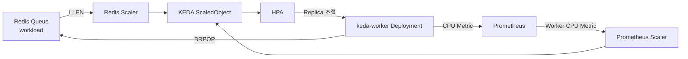

> Redis와 Prometheus를 서로 연결하는 것이 아니라, 하나의 ScaledObject가 Redis와 Prometheus를 동시에 조회하고 두 결과 중 더 많은 Replica를 요구하는 쪽을 HPA가 선택하도록 만드는 구조입니다. Kubernetes HPA는 여러 metric이 있으면 각 metric의 desired replica를 계산한 뒤 가장 큰 값을 사용합니다.
>
> 실제로 동작하는 형태로 Redis + Prometheus + KEDA Multi Trigger 테스트 환경을 만들어보겠습니다.
{: .prompt-tip}

#

## 2. 테스트 구성하기 :

- 이번 테스트의 전체 구조는 다음과 같습니다.



* * *

- 전체적인 동작 흐름은 다음과 같습니다.

```text
Redis Queue
    │
    │ Queue Length
    ▼
Redis Scaler
    │
    │
    ├──────────────┐
    │              │
    │         Prometheus
    │              │
    │        Worker CPU
    │              ▼
    │      Prometheus Scaler
    │              │
    └───────┬──────┘
            ▼
           KEDA
            │
            ▼
           HPA
            │
            ▼
       keda-worker
       Deployment
            │
            ▼
       Redis Task 처리
```

---

## 3. 테스트 목적 :

- 이번 테스트에서는 다음 내용을 확인합니다.

1. Redis Queue에 Task가 쌓이면 Worker가 자동으로 생성되는지 확인
2. Redis Queue Length에 따라 Replica가 증가하는지 확인
3. Worker가 Redis Queue를 실제로 소비하는지 확인
4. Worker가 Task를 처리하면서 CPU 사용량이 증가하는지 확인
5. Prometheus Metric이 KEDA Prometheus Scaler에 전달되는지 확인
6. Redis와 Prometheus 두 Trigger가 동시에 동작하는지 확인
7. 작업 종료 후 Worker가 천천히 Scale Down 되는지 확인
8. 최종적으로 Replica가 `0`까지 감소하는지 확인

---

## 4. 오토스케일링 기준 :

- 이번 테스트에서는 다음과 같은 기준을 사용합니다.

| 항목 | 값 | 의미 |
| --- | --- | --- |
| Redis Queue | `workload` | 작업 대기 Queue |
| Redis `listLength` | `10` | Worker 1개당 작업 10개 |
| Prometheus Metric | Worker 평균 CPU | 실제 Worker 포화도 |
| CPU Threshold | `0.7` | Worker 평균 CPU 0.7 Core |
| `minReplicaCount` | `0` | 작업이 없으면 Replica를 0개까지 축소 |
| `maxReplicaCount` | `10` | 최대 Worker 10개까지 확장 |
| Scale Up | 빠르게 | 작업 적체 발생 시 빠르게 Worker 확장 |
| Scale Down | 천천히 | 급격한 축소로 인한 Flapping 방지 |

* * *

## 5. Redis 구성하기 :
### 5.1 Redis Secret 생성하기 :

- Redis 인증을 위해 Password를 Secret으로 관리합니다.

```bash
$ vi redis-secret.yaml
```
```yaml
apiVersion: v1
kind: Secret
metadata:
  name: redis-secret
  namespace: keda-demo
type: Opaque
stringData:
  password: "KedaTest123!"
```
```bash
# 생성
$ kubectl apply -f redis-secret.yaml
```

> 운영 환경에서는 예제 Password를 그대로 사용하지 않고 별도의 Secret 관리 방식을 적용하는 것이 좋습니다.
{: .prompt-warning}

---

### 5.2 Redis Deployment 생성하기 :

- 다음으로 Redis Deployment를 생성합니다.

```bash
$ vi redis-deployment.yaml
```
```yaml
apiVersion: apps/v1
kind: Deployment
metadata:
  name: redis-keda
  namespace: keda-demo
spec:
  replicas: 1
  selector:
    matchLabels:
      app: redis-keda
  template:
    metadata:
      labels:
        app: redis-keda
    spec:
      containers:
        - name: redis
          image: harbor.test.com/library/redis:7.2
          command:
            - /bin/sh
            - -c
          args:
            - |
              exec redis-server \
                --appendonly no \
                --requirepass "${REDIS_PASSWORD}"
          env:
            - name: REDIS_PASSWORD
              valueFrom:
                secretKeyRef:
                  name: redis-secret
                  key: password
          ports:
            - containerPort: 6379
          resources:
            requests:
              cpu: 100m
              memory: 128Mi
            limits:
              cpu: 500m
              memory: 512Mi
```
```bash
# 생성
$ kubectl apply -f redis-deployment.yaml
```

> `harbor.test.com/library/redis:7.2` 부분은 실제 사용 중인 Harbor Redis Image 주소에 맞게 변경합니다.

---

### 5.3 Redis Service 생성하기 :

- KEDA Scaler와 Worker에서 Redis에 접근할 수 있도록 Service를 생성합니다.

```bash
$ vi redis-svc.yaml
```
```yaml
apiVersion: v1
kind: Service
metadata:
  name: redis-keda
  namespace: keda-demo
spec:
  selector:
    app: redis-keda
  ports:
    - name: redis
      port: 6379
      targetPort: 6379
  type: ClusterIP
```
```bash
# 생성
$ kubectl apply -f redis-svc.yaml
```

---

### 5.4 Redis 접속 확인하기 :

- Redis가 정상적으로 동작하는지 확인합니다.

```bash
$ kubectl exec -n keda-demo \
  deploy/redis-keda -- \
  redis-cli \
  -a 'KedaTest123!' \
  --no-auth-warning \
  ping
```


---

### 5.6 Redis Queue 확인하기 :

- 현재 Queue Length를 확인합니다.

```bash
$ kubectl exec -n keda-demo \
  deploy/redis-keda -- \
  redis-cli \
  -a 'KedaTest123!' \
  --no-auth-warning \
  LLEN workload
```


> 아직 Task를 넣지 않았기 때문에 결과는 ```0```으로 표기됩니다.
{: .prompt-tip}

---

## 6. Redis Queue를 처리할 Worker 구성하기 :
### 6.1 Worker 동작 방식 :

- 단순히 nginx Pod를 Scale 하는 것이 아니라 실제 Redis Queue에서 Task를 가져와 처리하는 Worker를 생성할거라 Worker는 다음과 같이 동작합니다.

```text
Redis Queue
     │
     │ BRPOP
     ▼
   Worker
     │
     ├── Task 가져오기
     │
     ├── CPU 작업 수행
     │
     ├── Task 완료
     │
     └── 다음 Task 가져오기
```

> Worker가 실제 Queue를 소비하도록 구성했기 때문에 Redis Queue가 감소하는 과정까지 확인할 수 있습니다.
{: .prompt-tip}

---

### 6.2 Worker Deployment 생성하기 :

> Worker Pod를 생성하는 이유는?
>
> Worker Pod는 Redis의 workload Queue에 쌓인 Task를 실제로 가져와 처리하기 위해 생성하고, KEDA는 Queue 상태를 감시하고 Replica 수만 조절하므로, 실제 Task를 소비하고 처리할 Worker가 필요합니다.
{: .prompt-question}

```bash
$ vi redis-deployment.yaml
```
```yaml
apiVersion: apps/v1
kind: Deployment
metadata:
  name: keda-worker
  namespace: keda-demo
spec:
  replicas: 0

  selector:
    matchLabels:
      app: keda-worker
  template:
    metadata:
      labels:
        app: keda-worker
    spec:
      containers:
        - name: worker
          image: harbor.test.com/library/redis:7.2
          command:
            - /bin/sh
            - -c
          args:
            - |
              echo "KEDA Worker Started"
              while true
              do
                TASK=$(redis-cli \
                  -h redis-keda \
                  -p 6379 \
                  -a "${REDIS_PASSWORD}" \
                  --no-auth-warning \
                  BRPOP workload 5 | tail -n 1)

                if [ -n "${TASK}" ]; then
                  echo "Processing Task: ${TASK}"
                  # Task를 가져온 후 다음 명령을 약 5초 동안 실행
                  timeout 5 \
                    sh -c 'while true; do :; done' \ 
                    || true
                  echo "Completed Task: ${TASK}"
                else
                  sleep 1
                fi
              done
          env:
            - name: REDIS_PASSWORD
              valueFrom:
                secretKeyRef:
                  name: redis-secret
                  key: password
          resources:
            requests:
              cpu: 100m
              memory: 64Mi
            limits:
              cpu: "1"
              memory: 128Mi
```
```bash
$ kubectl apply -f redis-deployment.yaml
```

---

- 생성 후 확인합니다.

```bash
$ kubectl get deploy keda-worker -n keda-demo
```


> Replica를 `0`으로 설정했기 때문에 Pod 개수는 `0`으로 확인됩니다.
{: .prompt-tip}

---

## 7. Prometheus Metric 확인하기 :

- KEDA Prometheus Scaler를 생성하기 전에 반드시 Prometheus에서 원하는 Metric이 정상적으로 조회되는지 먼저 확인 후, Prometheus에서 다음 Query를 실행합니다.

```promql
(
  sum(
    rate(
      container_cpu_usage_seconds_total{
        namespace="keda-demo",
        pod=~"keda-worker-.*",
        container="worker"
      }[1m]
    )
  )
  /
  clamp_min(
    sum(
      kube_pod_status_phase{
        namespace="keda-demo",
        pod=~"keda-worker-.*",
        phase="Running"
      } == 1
    ),
    1
  )
)
or vector(0)
```

---

## 8. Redis TriggerAuthentication 생성하기 :

- KEDA ScaledObject에 Redis Password를 직접 입력하지 않고 Kubernetes Secret을 참조하도록 설정합니다.

```bash
$ vi redis-trigger-auth.yaml
```
```yaml
apiVersion: keda.sh/v1alpha1
kind: TriggerAuthentication
metadata:
  name: redis-trigger-auth
  namespace: keda-demo
spec:
  secretTargetRef:
    - parameter: password
      name: redis-secret
      key: password
```
```bash
# 생성
$ kubectl apply -f redis-trigger-auth.yaml
```

---

- 생성 후, 확인합니다.

```bash
$ kubectl get triggerauthentication -n keda-demo
```


---

## 9. Redis + Prometheus Multi Trigger 구성하기 :

- 하나의 ScaledObject에 다음 두 개의 Trigger를 등록합니다.

```bash
$ vi scaledobject.yaml
```
```yaml
apiVersion: keda.sh/v1alpha1
kind: ScaledObject
metadata:
  name: keda-worker-multitrigger
  namespace: keda-demo
spec:
  scaleTargetRef:
    name: keda-worker
  pollingInterval: 5
  cooldownPeriod: 120
  minReplicaCount: 0
  maxReplicaCount: 10
  advanced:
    horizontalPodAutoscalerConfig:
      name: keda-worker-hpa
      behavior:
        # Scale Up 정책
        scaleUp:
          stabilizationWindowSeconds: 0
          policies:
            - type: Pods
              value: 4
              periodSeconds: 30
            - type: Percent
              value: 100
              periodSeconds: 30
          selectPolicy: Max
        # Scale Down 정책
        scaleDown:
          stabilizationWindowSeconds: 300
          policies:
            - type: Pods
              value: 1
              periodSeconds: 60
            - type: Percent
              value: 25
              periodSeconds: 60
          selectPolicy: Min
  triggers:
    ##################################################
    # Redis Queue Trigger
    ##################################################
    - type: redis
      name: redis-queue
      metricType: AverageValue
      metadata:
        address: redis-keda.keda-demo.svc:6379
        listName: workload
        listLength: "10"
        activationListLength: "0"
        databaseIndex: "0"
      authenticationRef:
        name: redis-trigger-auth

    ##################################################
    # Prometheus Worker CPU Trigger
    ##################################################
    - type: prometheus
      name: worker-cpu
      metricType: Value
      metadata:
        serverAddress: http://prometheus-kube-prometheus-prometheus.monitoring.svc:9090
        threshold: "0.70"
        activationThreshold: "0.10"
        ignoreNullValues: "false"
        query: |
          (
            sum(
              rate(
                container_cpu_usage_seconds_total{
                  namespace="keda-demo",
                  pod=~"keda-worker-.*",
                  container="worker"
                }[1m]
              )
            )
            /
            clamp_min(
              sum(
                kube_pod_status_phase{
                  namespace="keda-demo",
                  pod=~"keda-worker-.*",
                  phase="Running"
                } == 1
              ),
              1
            )
          )
          or vector(0)
```
```bash
$ kubectl apply -f scaledobject.yaml
```

---

- 생성된 ScaledObject를 확인합니다.

```bash
$ kubectl get scaledobject -n keda-demo
```


---

## 10. HPA 생성 확인하기 :

- KEDA가 자동으로 HPA를 생성했는지 확인합니다.

```bash
$ kubectl get hpa -n keda-demo
```


---

## 11. Redis Queue에 Task 테스트 하기 :
### 11.1 Redis Queue에 Task 40개 생성하기 :

- Redis의 `workload` Queue에 Task 40개를 넣습니다.

```bash
$ kubectl exec -n keda-demo \
  deploy/redis-keda -- \
  /bin/sh -c '
  for i in $(seq 1 40)
  do
    redis-cli \
      -a "${REDIS_PASSWORD}" \
      --no-auth-warning \
      LPUSH workload "task-${i}" >/dev/null
  done
  '
```

---

- Queue Length를 확인합니다.

```bash
$ kubectl exec -n keda-demo \
  deploy/redis-keda -- \
  redis-cli \
  -a 'KedaTest123!' \
  --no-auth-warning \
  LLEN workload
```


---

### 11.2 Redis Queue 감소 확인하기 :

- 별도의 터미널에서 Queue Length를 실시간으로 확인합니다.

```bash
$ watch -n 1 \
"kubectl exec -n keda-demo \
deploy/redis-keda -- \
redis-cli \
-a 'KedaTest123!' \
--no-auth-warning \
LLEN workload"
```

> Task가 처리되면서 Queue가 다음과 같이 감소합니다.


---

# 12. Prometheus Scaler 동작 확인하기 :

- Worker는 Task를 하나 가져오면 약 5초 동안 CPU 작업을 수행하고, Prometheus는 Worker의 CPU 사용률이 올라가기 시작하므로 Prometheus UI에서 다음 Query를 실행합니다.

```promql
(
  sum(
    rate(
      container_cpu_usage_seconds_total{
        namespace="keda-demo",
        pod=~"keda-worker-.*",
        container="worker"
      }[1m]
    )
  )
  /
  clamp_min(
    sum(
      kube_pod_status_phase{
        namespace="keda-demo",
        pod=~"keda-worker-.*",
        phase="Running"
      } == 1
    ),
    1
  )
)
or vector(0)
```


---

- 위 Query 값을 확인하여 Prometheus Trigger 설정은 다음과 같습니다.

```yaml
threshold: "1.0"
```

---

## 13. Redis와 Prometheus를 함께 사용하는 이유 :

- Redis는 **현재 Queue에 얼마나 많은 작업이 쌓여 있는지**를 확인하고, Prometheus는 **현재 실행 중인 Worker의 실제 부하 상태**를 확인합니다.

---

### 13.1 Redis 기준? "

- Redis는 현재 `workload` Queue에 남아 있는 작업 수를 기준으로 Worker의 필요 수량을 판단합니다.

```text
Redis Queue 증가
        ↓
처리 대기 작업 증가
        ↓
Worker Scale Up
```

---

- 예를 들어 Redis Queue에 작업이 많이 쌓이면 KEDA의 Redis Scaler가 이를 감지하여 Worker Replica를 증가시킵니다.

```text
Redis Queue = 40
        ↓
작업량 증가 감지
        ↓
Worker Scale Up
```

> 따라서 Redis Queue Length는 **앞으로 처리해야 할 작업량을 확인하는 지표**로 사용할 수 있습니다.
{: prompt-tip}

---

### 13.2 Prometheus 기준? :

- Prometheus는 현재 실행 중인 Worker의 CPU 사용량을 확인하기 때문에 Redis Queue가 감소하고 있더라도 Worker의 CPU 사용량이 계속 높다면, 현재 Worker들이 여전히 많은 작업을 처리하고 있다는 의미입니다.

```text
Worker CPU 증가
        ↓
현재 Worker 부하 증가
        ↓
Replica 유지 또는 추가 Scale Up
```

---

- 예를 들어 Worker의 평균 CPU가 설정한 Threshold보다 높은 경우 Prometheus Scaler는 추가 Worker가 필요하다고 판단할 수 있습니다.

```text
Worker 평균 CPU = 0.9 Core

CPU Threshold = 0.7 Core

0.9 > 0.7
        ↓
Worker 부하가 높은 상태
        ↓
Replica 유지 또는 추가 Scale Up
```

---

### 13.3 Redis와 Prometheus의 역할 :

- Redis와 Prometheus의 역할을 정리하면 다음과 같습니다.

| 구분 | 확인하는 값 | 역할 |
| --- | --- | --- |
| Redis | Queue Length | 처리해야 할 작업량 확인 |
| Prometheus | Worker CPU | 현재 Worker의 실제 부하 상태 확인 |

> Redis는 **작업이 얼마나 쌓여 있는지**를 확인하고, Prometheus는 **현재 Worker가 실제로 얼마나 바쁜지**를 확인합니다.
{: .prompt-info}

---

### 13.4 Multi Trigger 동작 방식 :

- Redis와 Prometheus Trigger를 함께 사용하면 각각 필요한 Replica 수를 계산합니다.

> 예를 들어 Redis 기준으로 2개의 Worker가 필요하고, Prometheus 기준으로 6개의 Worker가 필요하다고 가정합니다.
{: prompt-info}

```text
Redis       → Desired Replica = 2

Prometheus  → Desired Replica = 6
```

- 이 경우 HPA는 더 많은 Replica를 요구하는 값을 기준으로 Worker를 조절합니다.

```text
Redis       → 2
Prometheus  → 6

        ↓

    MAX(2, 6)

        ↓

Worker Replica = 6
```

> 따라서 Redis Queue가 감소하더라도 Worker의 실제 CPU 부하가 여전히 높다면 바로 Scale Down 하지 않고, 필요한 Worker 수를 유지하거나 추가로 Scale Up할 수 있습니다.
{: .prompt-tip}

---

### 13.5 Redis + Prometheus를 함께 사용하는 이유 :

- Redis만 사용하는 경우 Queue가 빠르게 감소하면 Worker가 아직 작업을 처리하고 있는 상황에서도 Scale Down이 발생할 수 있습니다.

```text
Redis Queue 감소
        ↓
필요 Worker 감소
        ↓
Scale Down
```

---

- Prometheus를 함께 사용하면 Worker의 실제 부하 상태까지 추가로 확인할 수 있습니다.

```text
Redis

"Queue가 많이 쌓였다."
        ↓
빠르게 Scale Up


Prometheus

"Queue는 줄었지만 Worker가 아직 바쁘다."
        ↓
Replica 유지 또는 추가 Scale Up
```

---

- 이를 통해 단순히 Queue Length만 기준으로 사용하는 것보다 실제 처리 상태까지 고려한 오토스케일링을 구성할 수 있습니다.

> Redis와 Prometheus를 함께 사용하면 **Redis의 작업량과 Prometheus의 실제 Worker 부하를 동시에 고려하여 보다 안정적인 운영형 오토스케일링 환경을 구성할 수 있습니다.**
{: .prompt-info}

---