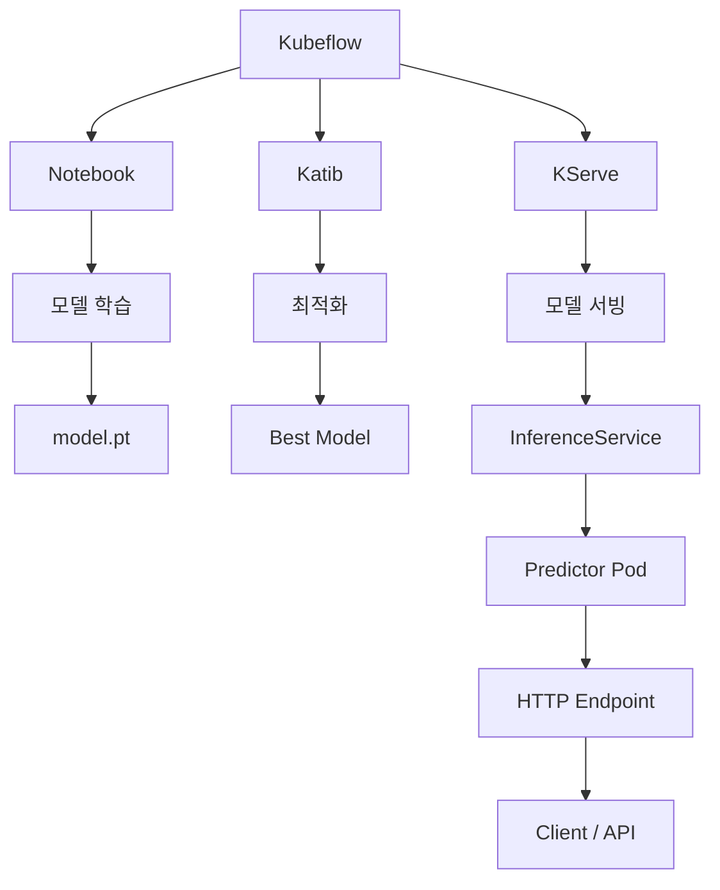
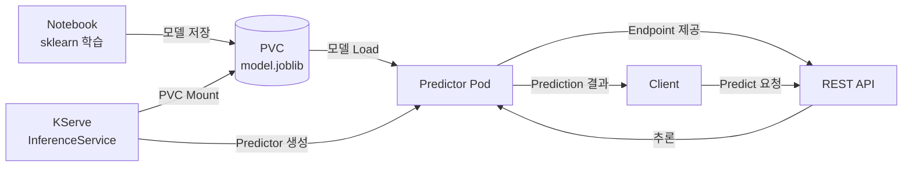
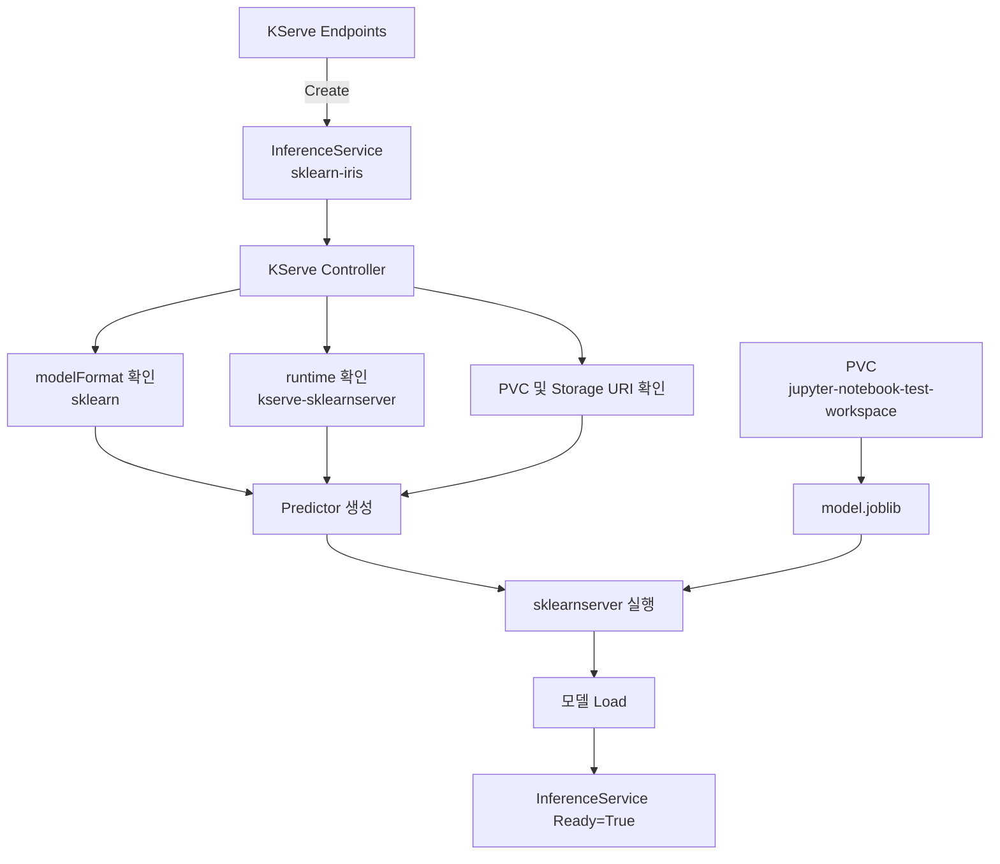

> Kubeflow Dashboard를 구축하여 MLOps 기능을 사용하고자 하나, ```KServe Endpoints``` 메뉴 페이지에 대한 라우팅이 구성되어 있지 않아 추가 구성이 필요합니다.
{: .prompt-warning}


---

## 1. KServe Endpoints는 무엇인가? :

- 학습이 끝난 머신러닝 모델을 API 형태로 서비스하는 Kubeflow 컴포넌트입니다.

> Kubeflow Dashboard의 KServe Endpoints는 이 모델 서빙 리소스를 GUI로 관리하는 화면이고, 공식적으로 KServe Models Web App은 InferenceService CR의 생성, 삭제, 상태 확인 등을 웹 화면에서 제공하며, Central Dashboard에서는 이를 KServe Endpoints 메뉴로 노출합니다.
{: .prompt-tip}

---

## 2. Endpoint와 InferenceService 관계 이해하기 :

- 핵심 개념은 Experiment → Suggestion → Trial입니다.



---

## 3. KServe Endpoints 설치하기 :

- 이전에 구축했던 Kubeflow 소스 구조를 그대로 사용하여 설치합니다.

---

### 3.1 KServe Endpoints YAML 파일 생성하기 :

- Knative Serving YAML을 생성합니다.

```bash
$ cd /root/kubeflow/community-distribution
# Knative service YAML 생성 
$ kustomize build \
  common/knative/knative-serving/overlays/gateways \
  > ./kubeflow-rendered/17_knative-serving.yaml
```

```bash
# Knative local gateway YAML 생성
$ kustomize build \
  common/istio/cluster-local-gateway/overlays/m2m-auth \
  > ./kubeflow-rendered/18_knative-local-gateway.yaml
```

---

- KServe 본체 YAML을 생성합니다.

```bash
$ kustomize build \
  applications/kserve/kserve \
  > ./kubeflow-rendered/19_kserve.yaml
```

---

- KServe Endpoints UI YAML을 생성합니다.

```bash
$ kustomize build \
  applications/kserve/models-web-app/overlays/kubeflow \
  > ./kubeflow-rendered/20_kserve-ui.yaml
```

---

### 3.2 KServe Endpoints Container Image 다운로드 :

- 위에서 생성한 Katib YAML을 통해 이미지 확인 후 다운받습니다.

```bash
$ docker pull docker.io/seldonio/mlserver:1.7.1
$ docker pull gcr.io/knative-releases/knative.dev/net-istio/cmd/controller@sha256:d849c758f269bf651bd2dd6a973a11d4029ecc2ba4c3bc0fd07b86252d5ab087
$ docker pull gcr.io/knative-releases/knative.dev/net-istio/cmd/webhook@sha256:2563f60b712dbba6cb4f67a0925437c2841ce57433d9733528cfdfd566106995
$ docker pull gcr.io/knative-releases/knative.dev/serving/cmd/activator@sha256:8f7e9df2642a8ba715ebc55b62abee17b0984b6b6af0c6ec00dabaadf5f8cccb
$ docker pull gcr.io/knative-releases/knative.dev/serving/cmd/autoscaler@sha256:ec66d97244395b57a67923d4a8c5a95f0264805f1fdb2ee0cdb49ec0f3bd7855
$ docker pull gcr.io/knative-releases/knative.dev/serving/cmd/controller@sha256:6833f2c83e9f356c274ddb2de40e5471ad2b1c08882c9bd11f5afa240e86d574
$ docker pull gcr.io/knative-releases/knative.dev/serving/cmd/queue@sha256:371c23206b7bd924474b07e51435198579133eb98fba27a5cb3db9e6ba63b06b
$ docker pull gcr.io/knative-releases/knative.dev/serving/cmd/webhook@sha256:c505888f7ee34ccadc1b9a6877d6d49691f633ea28cf8cbe03fcfa6d3afcd584
$ docker pull ghcr.io/kserve/models-web-app:0.18.0
$ docker pull kserve/huggingfaceserver:v0.18.0
$ docker pull kserve/huggingfaceserver:v0.18.0-gpu
$ docker pull kserve/kserve-controller:v0.18.0
$ docker pull kserve/kserve-localmodel-controller:v0.18.0
$ docker pull kserve/lgbserver:v0.18.0
$ docker pull kserve/llmisvc-controller:v0.18.0
$ docker pull kserve/paddleserver:v0.18.0
$ docker pull kserve/pmmlserver:v0.18.0
$ docker pull kserve/predictiveserver:v0.18.0
$ docker pull kserve/sklearnserver:v0.18.0
$ docker pull kserve/storage-initializer:v0.18.0
$ docker pull kserve/xgbserver:v0.18.0
$ docker pull nvcr.io/nvidia/tritonserver:23.05-py3
$ docker pull pytorch/torchserve-kfs:0.9.0
$ docker pull quay.io/brancz/kube-rbac-proxy:v0.18.0
$ docker pull registry.istio.io/release/proxyv2:1.30.1
$ docker pull tensorflow/serving:2.6.2

$ docker tag docker.io/seldonio/mlserver:1.7.1                                                                                                     harbor.test.com/kubeflow/seldonio/mlserver:1.7.1
$ docker tag gcr.io/knative-releases/knative.dev/net-istio/cmd/controller@sha256:d849c758f269bf651bd2dd6a973a11d4029ecc2ba4c3bc0fd07b86252d5ab087  harbor.test.com/kubeflow/knative-releases/knative.dev/net-istio/cmd/controller@sha256:d849c758f269bf651bd2dd6a973a11d4029ecc2ba4c3bc0fd07b86252d5ab087
$ docker tag gcr.io/knative-releases/knative.dev/net-istio/cmd/webhook@sha256:2563f60b712dbba6cb4f67a0925437c2841ce57433d9733528cfdfd566106995     harbor.test.com/kubeflow/knative-releases/knative.dev/net-istio/cmd/webhook@sha256:2563f60b712dbba6cb4f67a0925437c2841ce57433d9733528cfdfd566106995
$ docker tag gcr.io/knative-releases/knative.dev/serving/cmd/activator@sha256:8f7e9df2642a8ba715ebc55b62abee17b0984b6b6af0c6ec00dabaadf5f8cccb     harbor.test.com/kubeflow/knative-releases/knative.dev/serving/cmd/activator@sha256:8f7e9df2642a8ba715ebc55b62abee17b0984b6b6af0c6ec00dabaadf5f8cccb
$ docker tag gcr.io/knative-releases/knative.dev/serving/cmd/autoscaler@sha256:ec66d97244395b57a67923d4a8c5a95f0264805f1fdb2ee0cdb49ec0f3bd7855    harbor.test.com/kubeflow/knative-releases/knative.dev/serving/cmd/autoscaler@sha256:ec66d97244395b57a67923d4a8c5a95f0264805f1fdb2ee0cdb49ec0f3bd7855
$ docker tag gcr.io/knative-releases/knative.dev/serving/cmd/controller@sha256:6833f2c83e9f356c274ddb2de40e5471ad2b1c08882c9bd11f5afa240e86d574    harbor.test.com/kubeflow/knative-releases/knative.dev/serving/cmd/controller@sha256:6833f2c83e9f356c274ddb2de40e5471ad2b1c08882c9bd11f5afa240e86d574
$ docker tag gcr.io/knative-releases/knative.dev/serving/cmd/queue@sha256:371c23206b7bd924474b07e51435198579133eb98fba27a5cb3db9e6ba63b06b         harbor.test.com/kubeflow/knative-releases/knative.dev/serving/cmd/queue@sha256:371c23206b7bd924474b07e51435198579133eb98fba27a5cb3db9e6ba63b06b
$ docker tag gcr.io/knative-releases/knative.dev/serving/cmd/webhook@sha256:c505888f7ee34ccadc1b9a6877d6d49691f633ea28cf8cbe03fcfa6d3afcd584       harbor.test.com/kubeflow/knative-releases/knative.dev/serving/cmd/webhook@sha256:c505888f7ee34ccadc1b9a6877d6d49691f633ea28cf8cbe03fcfa6d3afcd584
$ docker tag ghcr.io/kserve/models-web-app:0.18.0                                                                                                  harbor.test.com/kubeflow/kserve/models-web-app:0.18.0
$ docker tag kserve/huggingfaceserver:v0.18.0                                                                                                      harbor.test.com/kubeflow/huggingfaceserver:v0.18.0
$ docker tag kserve/huggingfaceserver:v0.18.0-gpu                                                                                                  harbor.test.com/kubeflow/huggingfaceserver:v0.18.0-gpu
$ docker tag kserve/kserve-controller:v0.18.0                                                                                                      harbor.test.com/kubeflow/kserve-controller:v0.18.0
$ docker tag kserve/kserve-localmodel-controller:v0.18.0                                                                                           harbor.test.com/kubeflow/kserve-localmodel-controller:v0.18.0
$ docker tag kserve/lgbserver:v0.18.0                                                                                                              harbor.test.com/kubeflow/lgbserver:v0.18.0
$ docker tag kserve/llmisvc-controller:v0.18.0                                                                                                     harbor.test.com/kubeflow/llmisvc-controller:v0.18.0
$ docker tag kserve/paddleserver:v0.18.0                                                                                                           harbor.test.com/kubeflow/paddleserver:v0.18.0
$ docker tag kserve/pmmlserver:v0.18.0                                                                                                             harbor.test.com/kubeflow/pmmlserver:v0.18.0
$ docker tag kserve/predictiveserver:v0.18.0                                                                                                       harbor.test.com/kubeflow/predictiveserver:v0.18.0
$ docker tag kserve/sklearnserver:v0.18.0                                                                                                          harbor.test.com/kubeflow/sklearnserver:v0.18.0
$ docker tag kserve/storage-initializer:v0.18.0                                                                                                    harbor.test.com/kubeflow/storage-initializer:v0.18.0
$ docker tag kserve/xgbserver:v0.18.0                                                                                                              harbor.test.com/kubeflow/xgbserver:v0.18.0
$ docker tag nvcr.io/nvidia/tritonserver:23.05-py3                                                                                                 harbor.test.com/kubeflow/nvidia/tritonserver:23.05-py3
$ docker tag pytorch/torchserve-kfs:0.9.0                                                                                                          harbor.test.com/kubeflow/torchserve-kfs:0.9.0
$ docker tag quay.io/brancz/kube-rbac-proxy:v0.18.0                                                                                                harbor.test.com/kubeflow/brancz/kube-rbac-proxy:v0.18.0
$ docker tag registry.istio.io/release/proxyv2:1.30.1                                                                                              harbor.test.com/kubeflow/release/proxyv2:1.30.1
$ docker tag tensorflow/serving:2.6.2                                                                                                              harbor.test.com/kubeflow/tensorflow/serving:2.6.2

$ docker push harbor.test.com/kubeflow/seldonio/mlserver:1.7.1
$ docker push harbor.test.com/kubeflow/knative-releases/knative.dev/net-istio/cmd/controller@sha256:d849c758f269bf651bd2dd6a973a11d4029ecc2ba4c3bc0fd07b86252d5ab087
$ docker push harbor.test.com/kubeflow/knative-releases/knative.dev/net-istio/cmd/webhook@sha256:2563f60b712dbba6cb4f67a0925437c2841ce57433d9733528cfdfd566106995
$ docker push harbor.test.com/kubeflow/knative-releases/knative.dev/serving/cmd/activator@sha256:8f7e9df2642a8ba715ebc55b62abee17b0984b6b6af0c6ec00dabaadf5f8cccb
$ docker push harbor.test.com/kubeflow/knative-releases/knative.dev/serving/cmd/autoscaler@sha256:ec66d97244395b57a67923d4a8c5a95f0264805f1fdb2ee0cdb49ec0f3bd7855
$ docker push harbor.test.com/kubeflow/knative-releases/knative.dev/serving/cmd/controller@sha256:6833f2c83e9f356c274ddb2de40e5471ad2b1c08882c9bd11f5afa240e86d574
$ docker push harbor.test.com/kubeflow/knative-releases/knative.dev/serving/cmd/queue@sha256:371c23206b7bd924474b07e51435198579133eb98fba27a5cb3db9e6ba63b06b
$ docker push harbor.test.com/kubeflow/knative-releases/knative.dev/serving/cmd/webhook@sha256:c505888f7ee34ccadc1b9a6877d6d49691f633ea28cf8cbe03fcfa6d3afcd584
$ docker push harbor.test.com/kubeflow/kserve/models-web-app:0.18.0
$ docker push harbor.test.com/kubeflow/huggingfaceserver:v0.18.0
$ docker push harbor.test.com/kubeflow/huggingfaceserver:v0.18.0-gpu
$ docker push harbor.test.com/kubeflow/kserve-controller:v0.18.0
$ docker push harbor.test.com/kubeflow/kserve-localmodel-controller:v0.18.0
$ docker push harbor.test.com/kubeflow/lgbserver:v0.18.0
$ docker push harbor.test.com/kubeflow/llmisvc-controller:v0.18.0
$ docker push harbor.test.com/kubeflow/paddleserver:v0.18.0
$ docker push harbor.test.com/kubeflow/pmmlserver:v0.18.0
$ docker push harbor.test.com/kubeflow/predictiveserver:v0.18.0
$ docker push harbor.test.com/kubeflow/sklearnserver:v0.18.0
$ docker push harbor.test.com/kubeflow/storage-initializer:v0.18.0
$ docker push harbor.test.com/kubeflow/xgbserver:v0.18.0
$ docker push harbor.test.com/kubeflow/nvidia/tritonserver:23.05-py3
$ docker push harbor.test.com/kubeflow/torchserve-kfs:0.9.0
$ docker push harbor.test.com/kubeflow/brancz/kube-rbac-proxy:v0.18.0
$ docker push harbor.test.com/kubeflow/release/proxyv2:1.30.1
$ docker push harbor.test.com/kubeflow/tensorflow/serving:2.6.2
```

---

### 3.3 KServe Endpoints 생성하기 :

> 폐쇄망 환경에서 배포하는 경우 각 YAML의 지정된 이미지 경로를 harbor 주소로 변경하고, storageclass가 존재하는 경우 pvc 생성에 추가합니다.
{: .prompt-warning}

- 위 과정에서 생성한 YAML 파일을 가지고 배포합니다.

```bash
$ kubectl apply -f 17_knative-serving.yaml
$ kubectl apply -f 18_knative-local-gateway.yaml
$ kubectl apply -f 19_kserve.yaml --server-side --force-conflicts
$ kubectl apply -f 20_kserve-ui.yaml

# 상태 확인
$ kubectl get pod -n kubeflow
```


---

- KServe의 API, Runtime, 내부 네트워크, Dashboard 라우팅까지 전부 정상인지 확인합니다.

```bash
$ kubectl get svc -n kubeflow | grep kserve
$ kubectl get virtualservice -A | grep -i kserve
$ kubectl get crd | grep serving.kserve.io
$ kubectl get clusterservingruntime
```


---

## 4. KServe Endpoints 생성하기 :

- 실제 ML 학습 전에 Katib 동작 자체를 검증하는 아주 작은 Experiment를 생성하여 아래 흐름처럼 테스트해보겠습니다.



---

### 4.1 ClusterServingRuntime 이미지 설정 확인하기 :

- 생성 전에 설정된 이미지가 외부 Registry 주소로 나오면 Predictor 생성 단계에서 이미지 문제가 날 수 있으니 Harbor 주소로 먼저 변경해야합니다.

```bash
$ kubectl get clusterservingruntime -o json \
  | jq -r '.items[].spec.containers[].image' \
  | sort -u
```


---

### 4.2 Notebook에서 sklearn 설치 여부 확인하기 :

- Kubeflow Dashboard에서 생성한 Jupyter Notebook 서버(Pod/컨테이너)에서 진행합니다.


---

- Notebook에서 sklearn 설치되었는지 확인합니다.

```bash
$ pwd
$ python --version
$ python -c "import sklearn, joblib; print('sklearn:', sklearn.__version__)"
```


---

### 4.3 Notebook에서 Iris 테스트 모델 생성하기 :

- Python 스크립트 파일을 하나 만들어 실행하기 위해 모델 저장 디렉토리를 생성합니다.

```bash
$ mkdir -p /home/jovyan/kserve/sklearn-iris
```

---

- 테스트 스크립트를 생성하고 실행합니다.

```bash
cat > /home/jovyan/train_iris.py <<'EOF'
from pathlib import Path

from sklearn import datasets
from sklearn.svm import SVC
from joblib import dump

# 모델 저장 경로
model_dir = Path("/home/jovyan/kserve/sklearn-iris")
model_dir.mkdir(parents=True, exist_ok=True)

# Iris 데이터셋 로드
iris = datasets.load_iris()

X = iris.data
y = iris.target

# 모델 생성
model = SVC(gamma="scale")

# 모델 학습
model.fit(X, y)

# 모델 저장
model_path = model_dir / "model.joblib"
dump(model, model_path)

print("Model saved:", model_path)

# 간단한 추론 테스트
test_data = [
    [6.8, 2.8, 4.8, 1.4],
    [6.0, 3.4, 4.5, 1.6]
]

prediction = model.predict(test_data)

print("Prediction:", prediction)
EOF
```

```bash
# 실행
$ python /home/jovyan/train_iris.py
```


---

- 모델 파일이 실제로 생성됐는지 확인합니다.

```bash
$ ls -lh /home/jovyan/kserve/sklearn-iris/
```


---

### 4.4 Endpoint 생성하기 :

- Kubeflow Dashboard에서 ```KServe Endpoints > New Endpoint```를 클릭합니다.


---

- InferenceService를 생성합니다.

```yaml
apiVersion: serving.kserve.io/v1beta1
kind: InferenceService
metadata:
  name: sklearn-iris
  namespace: kubeflow-user
  annotations:
    serving.kserve.io/deploymentMode: "Knative"
spec:
  predictor:
    minReplicas: 1
    model:
      modelFormat:
        name: sklearn  # KServe에게 모델 정보를 알려줌
      runtime: kserve-sklearnserver
      storageUri: "pvc://jupyter-notebook-test-workspace/kserve/sklearn-iris/"
      resources:
        requests:
          cpu: "100m"
          memory: "256Mi"
        limits:
          cpu: "1"
          memory: "1Gi"
```


---

### 4.5 KServe InferenceService 이미지 Pull 시 x509 오류 해결하기 :

- KServe에서 InferenceService를 생성했을 때 다음과 같은 오류가 발생했습니다.


> 일반 Pod에서는 Harbor 이미지를 정상적으로 Pull하고 있었기 때문에 처음에는 CRI-O 인증서 문제로 생각할 수 있습니다.
> 
> 하지만 KServe를 Knative 모드로 사용할 경우 이미지 Pull 전에 Knative Controller가 Harbor에 직접 접근하여 이미지 Tag를 Digest로 확인합니다.
>
> 즉 Worker Node의 CRI-O에 Harbor CA가 등록되어 있어도 ```Knative Controller 내부```에서는 해당 CA를 신뢰하지 않을 수 있습니다.
{: .prompt-warning}

---

- 테스트 환경에서는 Harbor Registry의 Tag Resolution을 생략하도록 설정합니다.

```bash
$ kubectl edit cm config-deployment -n knative-serving

# 아래 값을 추가합니다.
data:
  registries-skipping-tag-resolving: "harbor.test.com" # 여기
```


---

- Knative Controller를 재시작합니다.

```bash
$ kubectl rollout restart deployment/controller -n knative-serving
```

---

### 4.6 Kserve InferenceService 상태 확인하기 :

- 위 에러 해결 후 InferenceService 생성하여 상태를 확인합니다.

```bash
$ kubectl get isvc -n kubeflow-user
```


---

- Kubeflow Dashboard에서도 확인 가능합니다.


---

### 4.7 KServe Endpoints의 동작 흐름도 이해하기 :



---

## 5. 추론 요청용 JSON 생성하기 :

```bash
# Master Node에서 진행
cat > iris-input.json <<'EOF'
{
  "instances": [
    [6.8, 2.8, 4.8, 1.4],
    [6.0, 3.4, 4.5, 1.6]
  ]
}
EOF
```

---

## 6. 테스트 진행하기 :
### 6.1 InferenceService URL 확인하기 :

- kubeflow-user 네임스페이스에 배포된 sklearn-iris InferenceService가 생성한 Kubernetes Service 리소스를 조회합니다. I

```bash
$ kubectl get svc sklearn-iris \
  -n kubeflow-user
```

---

### 6.2 예측 요청 보내기 :

- InferenceService의 호스트명을 조회한 뒤, 인증 쿠키를 담아 iris-input.json의 데이터를 예측 API로 POST 요청하여 추론 결과를 받아옵니다.

```bash
$ SERVICE_HOSTNAME=$(kubectl get isvc sklearn-iris \
  -n kubeflow-user \
  -o jsonpath='{.status.url}' | cut -d "/" -f 3)
```

```bash
$ curl -v \
  -H "Content-Type: application/json" \
  -H 'Cookie: oauth2_proxy_kubeflow=<OAuth2 세션 쿠키>' \
  http://${SERVICE_HOSTNAME}:1080/serving/kubeflow-user/sklearn-iris/v1/models/sklearn-iris:predict \
  -d @iris-input.json
```


---

## 6.3 예측 요청 시 access denied 에러 해결하기 :

- KServe에서 예측 요청 시 다음과 같은 오류가 발생했습니다.


---

- 해당 오류는 인증(Authentication) 문제일 수도 있지만, Istio의 `AuthorizationPolicy`에 의해 요청이 차단되었을 가능성도 있으나 두 원인을 한 번에 의심하기보다 단계적으로 좁혀가는 것이 디버깅에 유리하므로, 우선 AuthorizationPolicy가 403의 원인인지 여부만 명확히 검증하기 위해 임시 정책을 적용합니다.

> ⚠️ 아래 정책은 `sklearn-iris-predictor` 워크로드에 대한 모든 요청을 허용하는 **디버깅 전용 설정**입니다. 운영 환경 또는 보안이 중요한 환경에서는 사용하지 말고, 원인 확인 후 반드시 삭제하거나 최소 권한 원칙에 맞게 재설정해야 합니다.
{: .prompt-warning}

```bash
$ vi allow-sklearn-iris.yaml
```
```yaml
apiVersion: security.istio.io/v1
kind: AuthorizationPolicy
metadata:
  name: debug-allow-all-sklearn
  namespace: kubeflow-user
spec:
  selector:
    matchLabels:
      serving.knative.dev/service: sklearn-iris-predictor
  action: ALLOW
  rules:
  - {}
```
```bash
$ kubectl apply -f allow-sklearn-iris.yaml
```

---