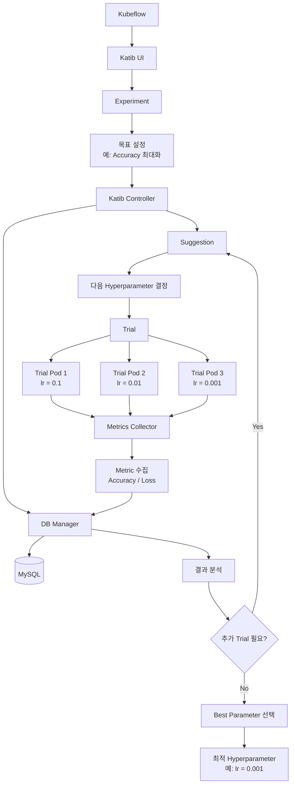

> Kubeflow Dashboard를 구축하여 MLOps 기능을 사용하고자 하나, ```Katib Experiments``` 메뉴 페이지에 대한 라우팅이 구성되어 있지 않아 추가 구성이 필요합니다.
{: .prompt-warning}


---

## 1. Katip은 무엇인가? :

- Kubeflow의 AutoML / Hyperparameter Tuning 기능입니다.

> Hyperparameter Tuning뿐 아니라 NAS(Neural Architecture Search), Early Stopping 등도 지원합니다.
{: .prompt-tip}

---

## 2. Katib의 구조 :

- 핵심 개념은 Experiment → Suggestion → Trial입니다.



---

- Katib Control Plane에는 공식적으로 다음 4개가 핵심입니다.

| 구성요소             | 역할                              |
| ------------------ | -------------------------------- |
| `katib-controller` | Experiment, Trial, Suggestion 관리 |
| `katib-ui`         | Kubeflow 웹 UI                    |
| `katib-db-manager` | Metric DB 접근용 gRPC API           |
| `katib-mysql`      | Experiment/Metric 데이터 저장         |

---

## 3. Katib 설치하기 :

- 이전에 구축했던 Kubeflow 소스 구조를 그대로 사용하여 설치합니다.

---

### 3.1 Katib YAML 파일 생성하기 :

```bash
$ cd /root/kubeflow/community-distribution/kubeflow-rendered
$ kustomize build applications/katib/upstream/installs/katib-with-kubeflow > ./kubeflow-rendered/16_katib.yaml
```

---

### 3.2 Katib Container Image 다운로드 :

- 위에서 생성한 Katib YAML을 통해 이미지 확인 후 다운받습니다.

```bash
$ docker pull ghcr.io/kubeflow/katib/file-metrics-collector:v0.19.0
$ docker pull ghcr.io/kubeflow/katib/tfevent-metrics-collector:v0.19.0
$ docker pull ghcr.io/kubeflow/katib/suggestion-hyperopt:v0.19.0
$ docker pull ghcr.io/kubeflow/katib/suggestion-optuna:v0.19.0
$ docker pull ghcr.io/kubeflow/katib/suggestion-hyperband:v0.19.0
$ docker pull ghcr.io/kubeflow/katib/suggestion-skopt:v0.19.0
$ docker pull ghcr.io/kubeflow/katib/suggestion-goptuna:v0.19.0
$ docker pull ghcr.io/kubeflow/katib/suggestion-enas:v0.19.0
$ docker pull ghcr.io/kubeflow/katib/suggestion-darts:v0.19.0
$ docker pull ghcr.io/kubeflow/katib/suggestion-pbt:v0.19.0
$ docker pull ghcr.io/kubeflow/katib/earlystopping-medianstop:v0.19.0
$ docker pull ghcr.io/kubeflow/katib/pytorch-mnist-cpu:v0.19.0
$ docker pull ghcr.io/kubeflow/katib/enas-cnn-cifar10-cpu:v0.19.0
$ docker pull ghcr.io/kubeflow/katib/katib-controller:v0.19.0
$ docker pull ghcr.io/kubeflow/katib/katib-db-manager:v0.19.0
$ docker pull docker.io/library/mysql:8.0
$ docker pull ghcr.io/kubeflow/katib/katib-ui:v0.19.0

$ docker tag ghcr.io/kubeflow/katib/file-metrics-collector:v0.19.0     harbor.test.com/kubeflow/katib/file-metrics-collector:v0.19.0
$ docker tag ghcr.io/kubeflow/katib/tfevent-metrics-collector:v0.19.0  harbor.test.com/kubeflow/katib/tfevent-metrics-collector:v0.19.0
$ docker tag ghcr.io/kubeflow/katib/suggestion-hyperopt:v0.19.0        harbor.test.com/kubeflow/katib/suggestion-hyperopt:v0.19.0
$ docker tag ghcr.io/kubeflow/katib/suggestion-optuna:v0.19.0          harbor.test.com/kubeflow/katib/suggestion-optuna:v0.19.0
$ docker tag ghcr.io/kubeflow/katib/suggestion-hyperband:v0.19.0       harbor.test.com/kubeflow/katib/suggestion-hyperband:v0.19.0
$ docker tag ghcr.io/kubeflow/katib/suggestion-skopt:v0.19.0           harbor.test.com/kubeflow/katib/suggestion-skopt:v0.19.0
$ docker tag ghcr.io/kubeflow/katib/suggestion-goptuna:v0.19.0         harbor.test.com/kubeflow/katib/suggestion-goptuna:v0.19.0
$ docker tag ghcr.io/kubeflow/katib/suggestion-enas:v0.19.0            harbor.test.com/kubeflow/katib/suggestion-enas:v0.19.0
$ docker tag ghcr.io/kubeflow/katib/suggestion-darts:v0.19.0           harbor.test.com/kubeflow/katib/suggestion-darts:v0.19.0
$ docker tag ghcr.io/kubeflow/katib/suggestion-pbt:v0.19.0             harbor.test.com/kubeflow/katib/suggestion-pbt:v0.19.0
$ docker tag ghcr.io/kubeflow/katib/earlystopping-medianstop:v0.19.0   harbor.test.com/kubeflow/katib/earlystopping-medianstop:v0.19.0
$ docker tag ghcr.io/kubeflow/katib/pytorch-mnist-cpu:v0.19.0          harbor.test.com/kubeflow/katib/pytorch-mnist-cpu:v0.19.0
$ docker tag ghcr.io/kubeflow/katib/enas-cnn-cifar10-cpu:v0.19.0       harbor.test.com/kubeflow/katib/enas-cnn-cifar10-cpu:v0.19.0
$ docker tag ghcr.io/kubeflow/katib/katib-controller:v0.19.0           harbor.test.com/kubeflow/katib/katib-controller:v0.19.0
$ docker tag ghcr.io/kubeflow/katib/katib-db-manager:v0.19.0           harbor.test.com/kubeflow/katib/katib-db-manager:v0.19.0
$ docker tag docker.io/library/mysql:8.0                               harbor.test.com/kubeflow/mysql:8.0
$ docker tag ghcr.io/kubeflow/katib/katib-ui:v0.19.0                   harbor.test.com/kubeflow/katib/katib-ui:v0.19.0

$ docker push harbor.test.com/kubeflow/katib/file-metrics-collector:v0.19.0
$ docker push harbor.test.com/kubeflow/katib/tfevent-metrics-collector:v0.19.0
$ docker push harbor.test.com/kubeflow/katib/suggestion-hyperopt:v0.19.0
$ docker push harbor.test.com/kubeflow/katib/suggestion-optuna:v0.19.0
$ docker push harbor.test.com/kubeflow/katib/suggestion-hyperband:v0.19.0
$ docker push harbor.test.com/kubeflow/katib/suggestion-skopt:v0.19.0
$ docker push harbor.test.com/kubeflow/katib/suggestion-goptuna:v0.19.0
$ docker push harbor.test.com/kubeflow/katib/suggestion-enas:v0.19.0
$ docker push harbor.test.com/kubeflow/katib/suggestion-darts:v0.19.0
$ docker push harbor.test.com/kubeflow/katib/suggestion-pbt:v0.19.0
$ docker push harbor.test.com/kubeflow/katib/earlystopping-medianstop:v0.19.0
$ docker push harbor.test.com/kubeflow/katib/pytorch-mnist-cpu:v0.19.0
$ docker push harbor.test.com/kubeflow/katib/enas-cnn-cifar10-cpu:v0.19.0
$ docker push harbor.test.com/kubeflow/katib/katib-controller:v0.19.0
$ docker push harbor.test.com/kubeflow/katib/katib-db-manager:v0.19.0
$ docker push harbor.test.com/kubeflow/mysql:8.0
$ docker push harbor.test.com/kubeflow/katib/katib-ui:v0.19.0
```

---

### 3.3 Katib 생성하기 :

> 폐쇄망 환경에서 배포하는 경우 각 YAML의 지정된 이미지 경로를 harbor 주소로 변경하고, storageclass가 존재하는 경우 pvc 생성에 추가합니다.
{: .prompt-warning}

- 위 과정에서 생성한 YAML 파일을 가지고 배포합니다.

```bash
$ kubectl apply -f 16_katib.yaml

# 상태 확인
$ kubectl get pod -n kubeflow
```


---

## 4. Katib Experiments 생성하기 :

- 실제 ML 학습 전에 Katib 동작 자체를 검증하는 아주 작은 Experiment를 생성하여 테스트해보겠습니다.

---

### 4.1 kubeflow profile namespace label 확인하기 :

- 현재 Experiment를 kubeflow-user에서 실행할 것이므로 해당 네임스페이스의 라벨을 확인합니다.

```bash
$ kubectl get ns kubeflow-user --show-labels
```

> ```katib.kubeflow.org/metrics-collector-injection=enabled``` 라벨이 존재한지 확인해야하며, 없을 경우 라벨을 추가합니다.
{: .prompt-warning}


---

### 4.2 간단한 Katib Experiment YAML 생성하기 :

```bash
$ vi katib-test.yaml
```
```yaml
apiVersion: kubeflow.org/v1beta1
kind: Experiment
metadata:
  name: katib-test
  namespace: kubeflow-user
spec:
  # 동시에 실행할 Trial 수
  parallelTrialCount: 2
  # 최대 Trial 실행 횟수
  maxTrialCount: 5
  # 허용할 실패 Trial 수
  maxFailedTrialCount: 3
  # 최적화 목표
  objective:
    type: maximize
    goal: 1000
    objectiveMetricName: result
  # Hyperparameter 검색 알고리즘
  algorithm:
    algorithmName: random
  # 검색할 Parameter
  parameters:
    - name: a
      parameterType: int
      feasibleSpace:
        min: "10"
        max: "20"
    - name: b
      parameterType: int
      feasibleSpace:
        min: "1"
        max: "5"
  # Trial stdout에서 result=값 형식의 Metric 수집
  metricsCollectorSpec:
    collector:
      kind: StdOut
  trialTemplate:
    primaryContainerName: training-container
    trialParameters:
      - name: a
        description: Parameter A
        reference: a
      - name: b
        description: Parameter B
        reference: b
    trialSpec:
      apiVersion: batch/v1
      kind: Job
      spec:
        template:
          metadata:
            annotations:
              sidecar.istio.io/inject: "false"
          spec:
            restartPolicy: Never
            containers:
              - name: training-container
                image: harbor.test.com/kubeflow/busybox:1.28
                imagePullPolicy: IfNotPresent
                command:
                  - sh
                  - -c
                args:
                  - |
                    A=${trialParameters.a}
                    B=${trialParameters.b}

                    echo "Parameter A = ${A}"
                    echo "Parameter B = ${B}"

                    # Collector가 붙을 시간을 확보하시 위해 지정
                    sleep 10 

                    RESULT=$((4 * A - B * B))
                    echo "result=${RESULT}"
```

---

### 4.3 Experiments 생성하기 :

```bash
# 생성
$ kubectl apply -f katib-test.yaml

# 확인
$ kubectl get pod -n kubeflow-user
```


---